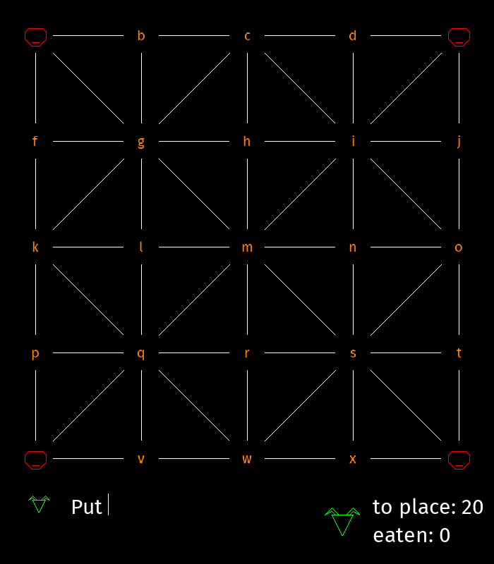
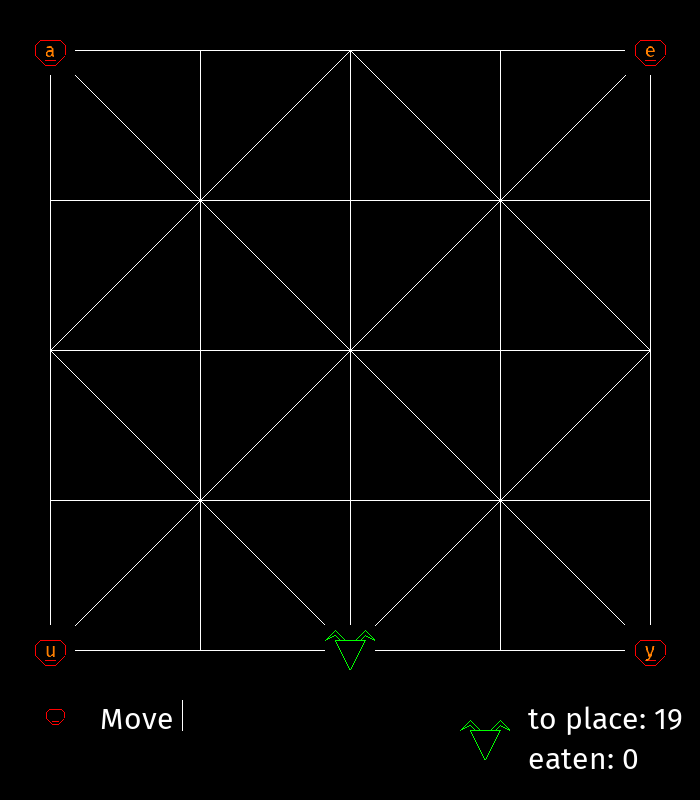
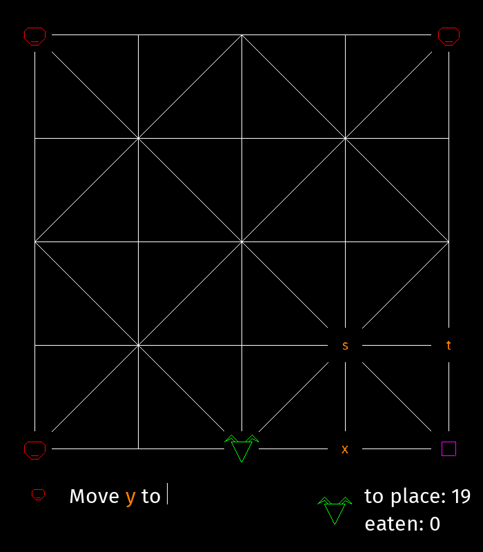

# Bagh Chal

This is a simple Bagh Chal game written in C. There are two interfaces, a graphical interface with the SDL library and a terminal interface with Termbox.


Both interfaces have the same features. You can click or type a position letter (from `a` to `y`) to select a token. 



Only possible positions are marked with a position letter.





## Installation

### Archlinux

If you are using Archlinux, you can find the GUI version in the [AUR repository](https://aur.archlinux.org/packages/bagh-chal-gui/).

### Building from sources

```bash
meson setup build
meson compile -C build
```

The binaries are `./build/bagh-chal-sdl` and `./build/bagh-chal-tb` for the SDL and Termbox versions.

## Dependencies

- [Termbox](https://github.com/nsf/termbox)
- [SDL2](https://www.libsdl.org)
- [SDL2_ttf](https://www.libsdl.org/projects/SDL_ttf)
